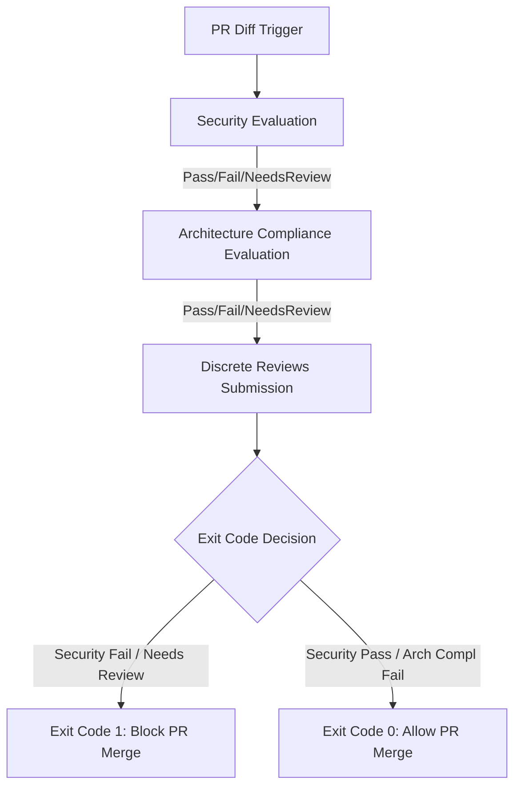

# LLM-as-a-Judge Evaluation Framework

This document outlines the architecture, conventions, and guidelines for the automated PR Code Review agent.

---

## 1. Overview of the Evaluation Pipeline

The review agent in [scripts/review.py](../scripts/review.py) acts as a multi-dimension LLM-as-a-Judge system. Every Pull Request undergoes two sequential evaluations:



1. **Security Evaluation (Sequential Call 1):** Scans the diff for critical vulnerabilities (leaked secrets, injection, bypasses). A failure here **blocks** the PR merge.
2. **Architecture Compliance Evaluation (Sequential Call 2):** Checks the diff against the repository conventions, design constraints, and ADR documents. A failure here is **non-blocking** and adds a review comment.

---

## 2. Structured Prompt Conventions (4-Part Standard)

Every evaluation dimension must adhere to a strict 4-part structure inside its system prompt:

1. **Criteria Definition:** A detailed list of specific rules, conventions, or vulnerabilities to search for in the code.
2. **Argumentation Structure:** Instructions on how the LLM should analyze the code and format its argument inside the `<reasoning>` block.
3. **Scoring Rule:** Clear guidelines mapping the analysis to one of three verdicts (`Pass`, `Fail`, or `Needs Review`) and defining what to output inside the `<findings>` block.
4. **Edge-Case Handling:** Explicit guidance on what to ignore (e.g. mock settings in test files) to minimize false positives.

*The exact prompt definitions and rules are maintained directly in code to prevent documentation drift:*
- **Security Prompt:** See `SYSTEM_PROMPT_SECURITY` in [scripts/review.py](../scripts/review.py#L60).
- **Architecture Compliance Prompt:** See `SYSTEM_PROMPT_ARCH` in [scripts/review.py](../scripts/review.py#L90).

---

## 3. Output XML Structure & Parsing

The LLM is instructed to output its evaluation using the following tags:
```xml
<reasoning>
[Verbose step-by-step thinking of the judge]
</reasoning>

<findings>
[Line-delimited JSON objects representing each finding, if FAIL]
</findings>
```

The script parses both blocks:
- The reasoning content is logged directly to OpenTelemetry span attributes and included in the GitHub PR review comment.
- The findings block is parsed line-by-line as JSON. If any valid finding is present, the verdict changes from `Pass` to `Fail`.
- If neither `<reasoning>` nor `<findings>` tags are present in the LLM's response, it is categorized as `Needs Review`.

---

## 4. Telemetry and Span Attributes

Each dimension is executed within its own trace span. Spans emit the following attributes for observability and metrics monitoring:
* `eval.dimension`: The name of the checked dimension (`security` or `architecture_compliance`).
* `eval.verdict`: The output verdict (`Pass`, `Fail`, or `Needs Review`).
* `eval.reasoning`: The extracted reasoning text.
* `eval.findings_count`: The number of detected findings in the XML block.

---

## 5. Guide: How to Add a New Evaluation Dimension

To add a new check (e.g., `performance_compliance`):

1. **Define the System Prompt:**
   Create a new string constant `SYSTEM_PROMPT_PERFORMANCE` in [scripts/review.py](../scripts/review.py) following the 4-part structure.

2. **Add a Tracer Span in `main()`:**
   Wrap the new evaluation logic inside a tracer span in `review.py`:
   ```python
   with tracer.start_as_current_span("performance_evaluation") as perf_span:
       perf_span.set_attribute("eval.dimension", "performance")
       # Call LLM and parse response
       raw_resp = call_llm_for_review(
           review_model, SYSTEM_PROMPT_PERFORMANCE, diff, openrouter_api_key
       )
       perf_verdict, perf_reasoning, perf_findings = evaluate_response(raw_resp)
       # Log attributes
       perf_span.set_attribute("eval.verdict", perf_verdict)
       # ...
   ```

3. **Wire GitHub Review Submission:**
   Define whether a failure in this new dimension blocks the PR (`--request-changes`) or just comments (`--comment`), and add it to the final discrete reviews submission logic.
