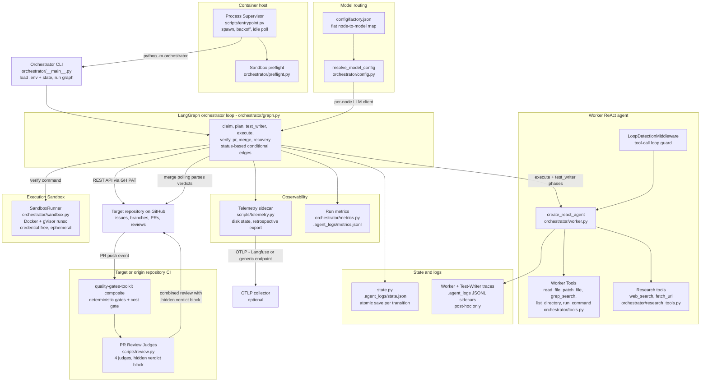

# Diagram: Architecture overview

Coarse component view of the Orchestrator: the supervisor, the LangGraph
loop, the Worker agent, persistence, observability, isolation, and the PR
judge pipeline. One diagram; rendered natively by GitHub.

## Grounded in

- **ADR-0009 / ADR-0010 / ADR-0011** — pure Python LangGraph orchestrator,
  test-first phase order, prebuilt ReAct agent for the Worker.
- **ADR-0015** — Process Supervisor as container entrypoint.
- **ADR-0016** — in-process telemetry, disk-based state, retrospective export.
- **ADR-0018** — flat `config/factory.json` model routing.
- **ADR-0029** — fire-and-forget run metrics accumulation.
- **ADR-0037 / ADR-0043** — Worker tool trust boundary; subprocess env
  allowlist.
- **ADR-0056** — split-plane Execution Sandbox (Docker + gVisor runsc).
- **ADR-0050 / ADR-0059** — Reusable Judge Workflow delivery; quality-gates
  toolkit as canonical gate provider (v1.7.0).
- **Code** — `scripts/entrypoint.py`, `orchestrator/__main__.py`,
  `orchestrator/graph.py`, `orchestrator/nodes.py`, `orchestrator/worker.py`,
  `orchestrator/tools.py`, `orchestrator/research_tools.py`,
  `orchestrator/state.py`, `orchestrator/config.py`, `orchestrator/metrics.py`,
  `orchestrator/sandbox.py`, `scripts/telemetry.py`, `scripts/review.py`,
  `.github/workflows/ci.yml`.

## Notes

- The Worker holds no orchestrator credentials: the sandbox is credential-free
  and git commits/pushes remain control-plane operations of the PR node.
- The Merge node never runs the judges itself — it only polls the verdicts the
  CI-side `scripts/review.py` posted under the trusted judge identity.
- `.agent_logs/state.json` is strictly for Stateful Resume; run metrics are
  deliberately not persisted across crashes (ADR-0029).
