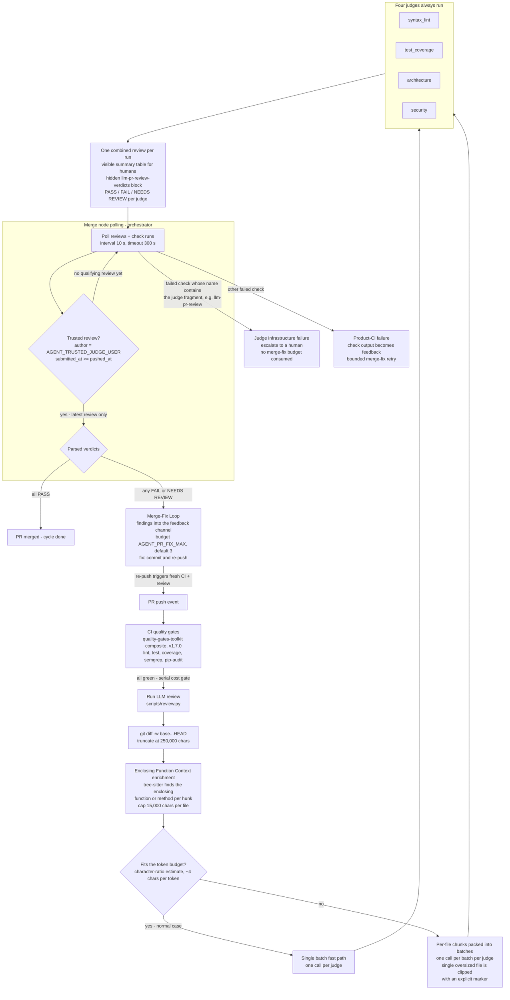

# Diagram: PR judge review

How a pushed PR is verified: the CI pipeline enriches and batches the diff,
four LLM judges produce verdicts posted as one combined review with a hidden
verdict block, and the orchestrator's Merge node polls, trusts, and acts on
those verdicts — including merge-fix retries and check-run fail-fast triage.
One diagram; rendered natively by GitHub.

## Grounded in

- **ADR-0014** — merge blocking on judge verdicts; commit-timestamp freshness
  (`submitted_at >= latest push`); trusted judge identity (spoofing guard).
- **ADR-0019** — one combined review body with the hidden machine-parseable
  verdict block; all four judges always run (no fail-fast between judges).
- **ADR-0022** — Enclosing Function Context enrichment (tree-sitter,
  15,000 chars per file).
- **ADR-0023** — tiered batch-packing evaluation with per-judge verdict
  aggregation; single-batch fast path for normal PRs.
- **ADR-0021** — layered retry for empty LLM responses; `NEEDS REVIEW` covers
  LLM-call failure.
- **ADR-0036 / ADR-0055** — bounded merge-fix loop; check-run fail-fast with
  dual triage (judge-infrastructure vs. fixable product-CI failure).
- **ADR-0050 / ADR-0059** — Reusable Judge Workflow delivery; origin repo
  consumes the toolkit composite (`v1.7.0`) with an explicit judge-token
  mapping.
- **Code** — `scripts/review.py` (writer), `orchestrator/nodes.py`
  (`merge_node` parser: `_extract_review_findings`, `_evaluate_check_failures`),
  `.github/workflows/ci.yml`.

## Notes

- The writer (`scripts/review.py`) and the parser (`merge_node`) are coupled
  in lockstep by the hidden block format — the visible table may drift, the
  block may not.
- Verdict aggregation per judge: any chunk `FAIL` → judge `FAIL`; any chunk
  unable to be evaluated → `NEEDS REVIEW`; otherwise `PASS`. There is no
  `SKIPPED` verdict state.
- Configurable values shown: `AGENT_MERGE_POLL_INTERVAL` (10 s),
  `AGENT_MERGE_POLL_TIMEOUT` (300 s), `AGENT_PR_FIX_MAX` (3),
  `AGENT_JUDGE_CHECK_NAMES` (default fragment `llm-pr-review`), the diff
  truncation limit and per-file enrichment cap.
- In No-Judge Merge Mode (ADR-0054) the entire verdict-polling branch is
  skipped; the loop waits for an external merge within a human-scale window
  and pauses resumably on expiry.
