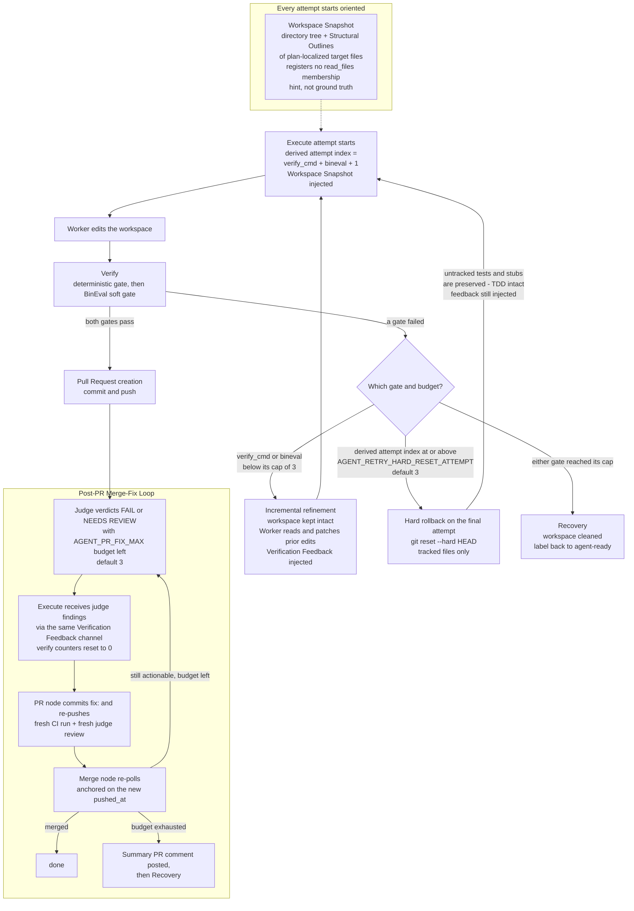

# Diagram: Retry and workspace state

How the workspace is treated across retry attempts: incremental refinement
while budgets remain, a hard rollback of tracked files on the final attempt,
per-gate verify budgets, and the post-PR Merge-Fix Loop that reuses the same
Execute path. One diagram; rendered natively by GitHub.

## Grounded in

- **ADR-0013** — Incremental Refinement: the workspace stays intact across
  verify failures; the Worker patches its prior edits.
- **ADR-0034** — Hybrid Retry: hard rollback (`git reset --hard`, tracked
  files only) from the threshold attempt onward; never `git clean` (the
  Test-Writer's untracked tests and stubs must survive); feedback is
  preserved across the reset (Reflexion).
- **ADR-0047** — split per-gate counters `attempts["verify_cmd"]` and
  `attempts["bineval"]`, each capped at 3; the derived execute attempt index
  = `verify_cmd + bineval + 1` drives the reset threshold.
- **ADR-0053** — Workspace Snapshot at attempt start (tree + target-file
  outlines, bounded at 20,000 chars, no read registration).
- **ADR-0036** — closed post-PR judge-feedback loop: `merge → execute` edge,
  `fix:` commit, per-cycle verify-budget reset, escalation comment at
  exhaustion.
- **Code** — `orchestrator/nodes.py` (`execute_node` reset logic,
  `verify_node`, `merge_node` merge-fix feedback, `_reset_verify_success`),
  `orchestrator/snapshot.py`, `orchestrator/state.py` (`attempts`).

## Notes

- Configurable values shown: `AGENT_RETRY_HARD_RESET_ATTEMPT` (default 3),
  per-gate verify caps (`VERIFY_MAX_ATTEMPTS`, default 3 each),
  `AGENT_PR_FIX_MAX` (default 3), `AGENT_SNAPSHOT_MAX_CHARS` (default 20,000).
- The hard reset reverts to the branch tip created by the Claim node; Worker
  created untracked files from earlier attempts persist into the final
  attempt (accepted residual — the Worker can read and fix or delete them).
- Crash safety: the reset decision derives from persisted `attempts`, and
  `git reset --hard HEAD` is idempotent, so a resumed run re-entering the
  threshold attempt re-runs it safely.
