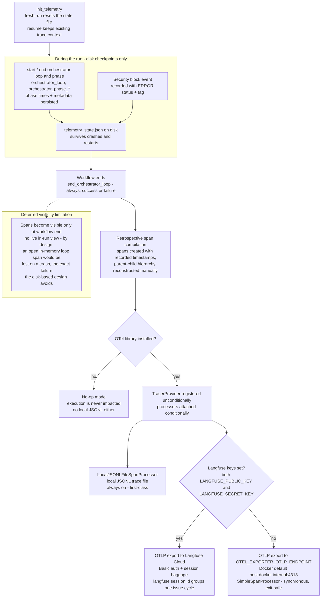

# Diagram: Telemetry pipeline

The telemetry sidecar: spans are checkpointed to disk during the run and
compiled retrospectively at workflow end, then exported to a local JSONL
file and, when configured, an OTLP endpoint (Langfuse Cloud or a generic
collector). Includes the deferred-visibility limitation. One diagram;
rendered natively by GitHub.

## Grounded in

- **ADR-0016** — disk-based state persistence with retrospective exporting;
  the 2026-07 amendment (local JSONL decoupled from OTLP export) and the
  2026-08 amendment (synchronous export via `SimpleSpanProcessor`, which does
  not create live in-run visibility).
- **ADR-0029** — run metrics are the deliberate contrast: in-memory,
  no crash persistence, one record per completed cycle.
- **ADR-0044** — security-block span events with ERROR status and the
  `security-block` tag.
- **Code** — `scripts/telemetry.py` (`init_telemetry`, `start_/end_orchestrator_loop`,
  `start_/end_orchestrator_phase`, `record_security_block`,
  `_export_recorded_spans`), `scripts/redaction.py` (secret redaction before
  persistence/export).

## Notes

- Worker and Test-Writer ReAct conversations are separate JSONL sidecars
  (`.agent_logs/`, post-hoc debugging only) — they are never loaded back into
  the loop and are not part of the OTLP span export.
- A failed or absent OTLP exporter never blocks the local file processor;
  tracing never breaks execution.
- Configurable values shown: `LANGFUSE_PUBLIC_KEY` / `LANGFUSE_SECRET_KEY`
  (Langfuse export), `OTEL_EXPORTER_OTLP_ENDPOINT` (generic OTLP; defaulted
  to `host.docker.internal:4318/v1/traces` only inside Docker when unset).
