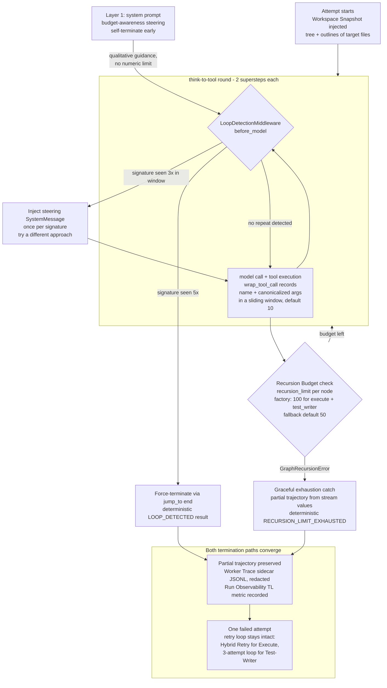

# Diagram: Worker reasoning budget

The three-layer defense around the Worker's ReAct loop: Tool Loop Detection
stops an identical-repeat pathology early, the Recursion Budget crash guard
bounds genuine runaways, and graceful exhaustion converts both into one
failed attempt with an observable partial trajectory. One diagram; rendered
natively by GitHub.

## Grounded in

- **ADR-0045** — configurable Recursion Budget per node
  (`resolve_model_config`, env overrides `{NODE}_RECURSION_LIMIT` /
  `AGENT_RECURSION_LIMIT`) and the graceful `GraphRecursionError` catch via
  `stream(stream_mode="values")`.
- **ADR-0046** — Tool Loop Detection middleware: keying on name + full
  canonicalized arguments, warn at 3, hard limit 5, window 10, `jump_to: end`.
- **ADR-0053** — Workspace Snapshot injection; paired factory raise of
  `recursion_limit` to 100 for `execute` and `test_writer` (the resolver's
  `DEFAULT_RECURSION_LIMIT` of 50 remains the fallback).
- **ADR-0016 / ADR-0029** — Worker Trace sidecar and Run Observability metrics
  must run on the partial trajectory.
- **Code** — `orchestrator/worker.py` (`ToolLoopDetector`,
  `LoopDetectionMiddleware`, `execute_worker`), `orchestrator/config.py`
  (`_resolve_recursion_limit`, `_resolve_loop_config`),
  `orchestrator/metrics.py` (`count_tool_invocations`).

## Notes

- All thresholds shown are the current defaults and configurable: loop warn /
  hard / window are per-node Model Config fields (`loop_hard_limit <= 0`
  disables loop detection); the recursion budget is env-overridable per node.
- Loop detection never raises — it routes via `jump_to`; the Recursion Budget
  remains the crash guard for non-repeating runaways.
- Zero tool invocations on exhaustion (an empty immediate loop) is logged at
  ERROR so a framework-level infinite-loop regression stays detectable.
- Layer 1 injects qualitative self-termination guidance only — the numeric
  limit is deliberately not copied into the prompt.
