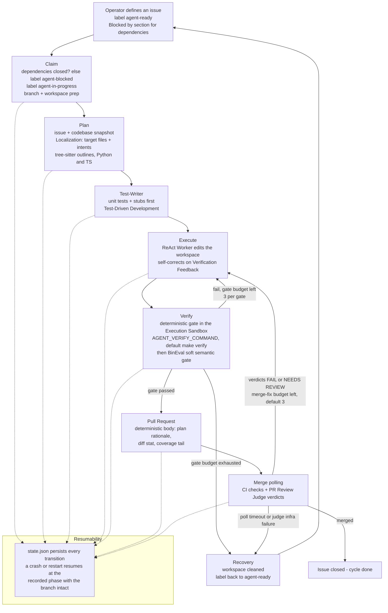

# Diagram: Usage process

The intended usage process from the operator's viewpoint: define an issue,
the orchestrator cycle processes it autonomously, the PR is verified and
judge-reviewed, then the loop merges, retries, or resumes. One diagram;
rendered natively by GitHub.

## Grounded in

- **ADR-0009** — pure Python LangGraph orchestration; the phase machine is the
  graph in `orchestrator/graph.py`, nodes in `orchestrator/nodes.py`.
- **ADR-0010** — Test-First loop: Claim → Plan → Test-Writer → Execute →
  Verify → PR → Merge.
- **ADR-0012 / ADR-0017** — structured JSON planning with path-safety
  validation; tree-sitter Structural Outlines for Python/TypeScript.
- **ADR-0014 / ADR-0019** — PR verification and LLM judge review; hidden
  verdict block parsed during Merge Polling.
- **ADR-0036** — bounded post-PR Merge-Fix Loop (`AGENT_PR_FIX_MAX`, default 3).
- **ADR-0047** — per-gate verify attempt budgets (`verify_cmd`, `bineval`),
  each capped at 3.
- **ADR-0016** — Stateful Resume via `.agent_logs/state.json`.
- **Code** — `orchestrator/graph.py` (routers), `orchestrator/nodes.py`
  (node bodies), `orchestrator/state.py`.

## Notes

- Status values persisted along the way: `idle | claimed | planning |
  executing | verifying | pr_open | merging | done | failed`.
- The Merge-Fix Loop and Hybrid Retry both re-enter Execute; they differ in
  trigger (judge verdicts vs. local verify failures) and budget
  (`AGENT_PR_FIX_MAX` vs. the per-gate verify caps) — see
  [detailed-retry-workspace.md](detailed-retry-workspace.md).
- No-Judge Merge Mode (`AGENT_JUDGE_ENABLED=false`, ADR-0054) replaces verdict
  polling with a human-scale merge window (default 24 h, resumable pause on
  expiry) for target repositories without the Reusable Judge Workflow.
