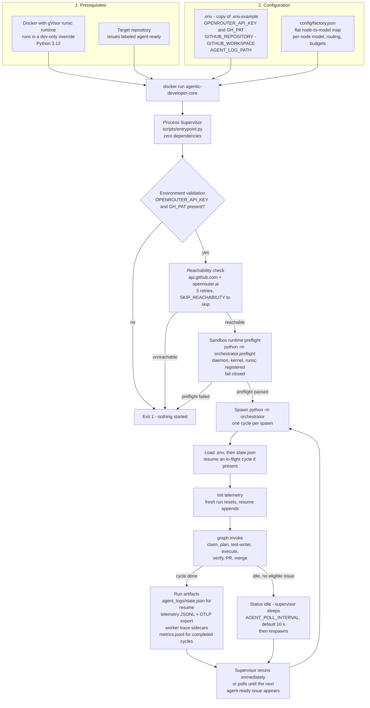

# Diagram: Setup flow

How to get from an empty machine to a running orchestrator cycle, and what a
started run produces. One diagram; rendered natively by GitHub.

## Grounded in

- **ADR-0015** — Python-based Process Supervisor: environment validation,
  reachability checks, resilient spawn loop (`scripts/entrypoint.py`).
- **ADR-0018** — flat `config/factory.json` schema, resolved per node by
  `resolve_model_config()` (`orchestrator/config.py`).
- **ADR-0056** (FR-1..FR-4) — Execution Sandbox on Docker + gVisor; the
  fail-closed runtime preflight (`orchestrator/preflight.py`, spawned as a
  subprocess so the supervisor stays zero-dependency).
- **Code** — `scripts/entrypoint.py` (validate → reachability → preflight →
  spawn → backoff/poll), `orchestrator/__main__.py` (`.env` load, state load,
  telemetry init, `graph.invoke`), `orchestrator/state.py` (`.agent_logs/`
  layout).

## Notes

- The sandbox runtime preflight refuses startup when gVisor is not registered
  with the Docker daemon — a missing runtime is a configuration error, never a
  silent degradation to shared-kernel containers.
- A run "produces" both in-repo artifacts (the PR on the target repository)
  and local sidecars under `.agent_logs/`; `metrics.jsonl` only receives a
  record for fully completed cycles.
- Configurable values shown: `AGENT_POLL_INTERVAL` (default 10 s),
  `AGENT_LOG_PATH` (default `.agent_logs`), `SKIP_REACHABILITY`,
  `AGENT_SANDBOX_RUNTIME` (default `runsc`).
